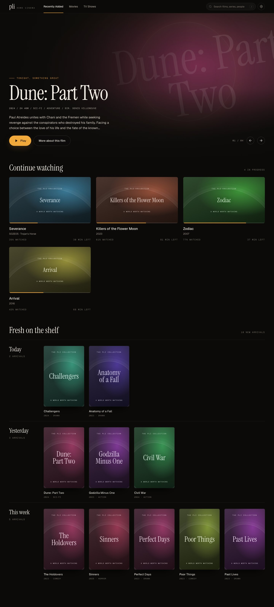

# pli

pli is a single-binary Plex web app built with Rust, Topcoat, and Toasty. The Cinema interface browses your movies and TV shows, shows recently added titles and playback progress, and opens videos in IINA or VLC.



## Run

Install Rust 1.98 or later, then run:

```sh
cargo run --locked
```

Open [localhost:8080](http://localhost:8080). JavaScript, CSS, and icons are embedded in the binary. The interface loads fonts from Google Fonts and has local font fallbacks. Node.js is only needed for browser tests and the sample preview.

## Connect Plex

1. Open **Settings**. The default Plex server URL is `http://127.0.0.1:32400`, for running pli on the Plex machine. When running pli elsewhere, enter the server address, such as `http://darwin:32400`, and click **Save**.
2. Click **Sign in with Plex**, or **Re-authenticate** if you already have a token. Approve access on Plex's sign-in page. If your browser blocks the popup, use the **Open Plex sign-in** link.
3. Click **Test Connection**, then open your library.

pli saves the authorized token automatically. You can also enter an existing Plex token. Movie posters, TV posters, episode stills, and backdrops come from your Plex server through pli's image proxy and disk cache. Titles without artwork get a typographic cover.

Choose IINA or VLC in Settings. The chosen player must be installed on the device running your browser. pli preserves IINA's playback callback parameters, timeline updates, intro and credits markers, and next-episode context. Plex remains the source of truth for media, watched state, and deletion.

## Configuration and data

| Variable | Default | Purpose |
| --- | --- | --- |
| `PLI_ADDR` | `0.0.0.0:8080` | HTTP listen address |
| `PLI_DB_PATH` | `data/pli.db` | SQLite settings and response cache |
| `PLI_IMAGE_CACHE_TTL_SECS` | `86400` | Artwork lifetime in seconds; `0` disables caching |

The default listen address accepts connections on all network interfaces. Use `PLI_ADDR=127.0.0.1:8080` to listen only on this machine.

The Rust app opens the existing Go app's SQLite database. It keeps saved settings, tokens, client IDs, and legacy media tables, and adds its own cache table. Toasty handles application queries and transactions; additive SQLite DDL initializes the schema without resetting existing data.

Images are cached under `cache/images-rust` next to the database. Each cache key includes the Plex server, token, and artwork path. Expired images are fetched again on request. Startup and hourly cleanup during cache writes remove expired files. Browser responses use `no-store` so changing servers or signing in again cannot reuse another connection's artwork.

## Development

```sh
just serve       # Run the app
just build       # Build bin/pli in release mode
just check       # Format, lint, and Rust tests
npm ci
npx playwright install chromium
just test-ui     # Browser and HTTP integration tests
just preview     # Sample Cinema library at localhost:18080
```

The browser suite starts an isolated Plex fixture and a temporary database. It checks library pagination, playback metadata, watched changes, deletion, image caching and expiration, sign-in UI, search, navigation, settings, and responsive layouts without changing your Plex library. The preview uses sample titles from the supplied Cinema design. It does not connect to your real Plex server.
